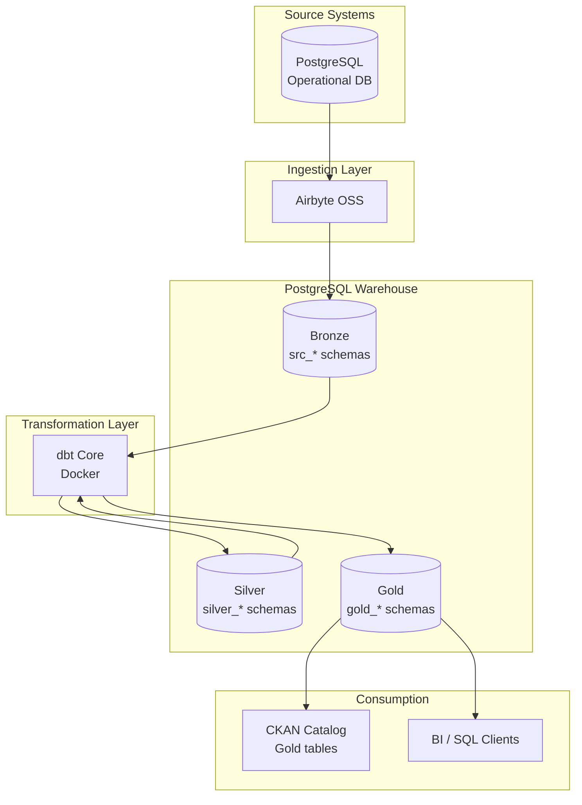

# End-to-end ELT platform (Airbyte → dbt → Airflow → CKAN)

**Repo:** `end-to-end-elt-pipeline`

Production-shaped **ELT** reference stack for local demos and portfolio work:
Airbyte lands raw data (**Bronze**) → dbt builds curated analytics models (**Silver/Gold**) → Airflow orchestrates runs + alerts → CKAN publishes Gold tables to a professional catalog UI.

---

## Overview

This project is a **production-oriented proof of concept** for a scalable data platform. It implements:

- **Extract & Load (EL)** via Airbyte into a PostgreSQL warehouse landing zone
- **Transform (T)** via dbt Core using SQL-based, testable models
- **Medallion Architecture** with conformed Silver tables and dimensional Gold marts
- **Containerized deployment** for reproducible local and portfolio demonstrations

The stack is designed to scale from a laptop PoC to a team environment by swapping orchestration and catalog tooling without redesigning the data layers.

---

## Architecture (high-level)




### Medallion layers


| Layer | Examples | Owner | Purpose |
|------|----------|-------|---------|
| **Bronze** | `src_local_postgres`, `src_sap_chemicals` | Airbyte | Raw landing tables (includes `_airbyte_*` metadata columns) |
| **Silver** | `silver_sales`, `silver_sap` | dbt | Conformed, deduplicated **incremental tables** (not views on Bronze) |
| **Gold** | `gold_sales`, `gold_sap` | dbt | Dimensions (`dim_*`), facts (`fct_*`), marts (`mart_*`) for analytics + CKAN publishing |


### Containerization

All services attach to an external Docker network (`de_poc_network`). Components are split into modular folders so each can be started, stopped, and versioned independently.

```
end-to-end-elt-pipeline/
├── source-postgres/       # Synthetic operational database (source)
├── warehouse-postgres/    # Analytics warehouse (destination)
├── airbyte-platform/      # Airbyte OSS ingestion stack
├── dbt-warehouse/         # dbt Core transformation project (Dockerized)
├── airflow-platform/      # Apache Airflow orchestration (LocalExecutor)
└── ckan-platform/         # CKAN open data catalog (Gold datamart UI)
```

---

## Technology Stack


| Capability                    | Tool                                          | Role                                                        |
| ----------------------------- | --------------------------------------------- | ----------------------------------------------------------- |
| **Ingestion**                 | [Airbyte](https://airbyte.com/)               | EL pipelines from Postgres source to warehouse Bronze layer |
| **Transformation**            | [dbt Core](https://www.getdbt.com/)           | SQL models, tests, documentation, incremental processing    |
| **Warehouse**                 | [PostgreSQL 16](https://www.postgresql.org/)  | Central store for Bronze, Silver, and Gold                  |
| **Containerization**          | Docker & Docker Compose                       | Environment isolation and reproducible deployments          |
| **Orchestration** | [Apache Airflow](https://airflow.apache.org/) | Config-driven ELT DAG factory from YAML (`airflow-platform/config/pipelines/*.yaml`) |
| **Data Catalog** | [CKAN](https://ckan.org/) (`ckan-platform/`) | Gold tables published to CKAN Datastore; UI `:5001` |


---

## Key Highlights

- **Modular dbt models** — Staging, intermediate, dimensions, facts, and marts with `ref()`-driven lineage
- **Production Silver pattern** — Incremental **tables** (not views on Bronze), so Airbyte syncs without `DROP CASCADE`
- **Environment isolation** — Credentials via `.env` (git-ignored); `.env.example` templates for each service
- **Data quality** — dbt tests (`unique`, `not_null`, `relationships`, `dbt_utils` range checks) on sources and marts
- **Performance-aware design** — Incremental facts, indexes via post-hooks, configurable `DBT_THREADS` for ~1M+ row workloads
- **Orchestrated ELT** — Airflow: Airbyte → **source freshness** → Silver → snapshots → tests → Gold → CKAN publish → email alerts
- **Local best practices** — [docs/BEST_PRACTICES_LOCAL.md](docs/BEST_PRACTICES_LOCAL.md) (prune hooks, CI, config-as-code)

---

## Documentation hub (start here)

- **Docs index:** `docs/README.md`
- **Runbook (Thai, step-by-step):** `docs/RUN_STEP_BY_STEP.md`
- **Credential map:** `docs/CREDENTIALS.md`
- **Multi-pipeline architecture (YAML → DAG):** `docs/MULTI_PIPELINE_ARCHITECTURE.md`
- **SAP pipeline guide:** `docs/SAP_CHEMICALS_PIPELINE.md`
- **Failure drills (practice incidents):** `docs/MONITORING_FAILURE_DRILL.md`
- **Failure email debug checklist:** `docs/FAILURE_EMAIL_DEBUG_CHECKLIST.md`
- **Airflow setup:** `airflow-platform/docs/AIRFLOW_SETUP.md`
- **Airflow email alerting:** `airflow-platform/docs/AIRFLOW_ALERTING.md`
- **CKAN setup + token sync:** `ckan-platform/docs/CKAN_SETUP.md`

---

## Prerequisites

- Docker Engine 24+ and Docker Compose v2
- 8 GB RAM and 4 CPUs recommended (Airbyte)
- Git

---

## Quick Start

### 1. Clone and configure `.env`

```bash
git clone https://github.com/<your-username>/end-to-end-elt-pipeline.git
cd end-to-end-elt-pipeline

# Copy templates, then align warehouse password across 3 files (see docs/CREDENTIALS.md)
cp source-postgres/.env.example source-postgres/.env
cp warehouse-postgres/.env.example warehouse-postgres/.env
cp airbyte-platform/.env.example airbyte-platform/.env
cp dbt-warehouse/.env.example dbt-warehouse/.env
cp airflow-platform/.env.example airflow-platform/.env
```

See the full Thai runbook: `docs/RUN_STEP_BY_STEP.md`

### 2. Create the shared Docker network

```bash
docker network create de_poc_network
```

### 3. Start infrastructure (recommended order)

```bash
# Source database
cd source-postgres && docker compose up -d

# Warehouse database
cd ../warehouse-postgres && docker compose up -d

# Airbyte (first boot may take several minutes)
cd ../airbyte-platform && docker compose up -d
```


| Service            | Host URL / Port                                |
| ------------------ | ---------------------------------------------- |
| Source Postgres    | `localhost:5433`                               |
| Warehouse Postgres | `localhost:5434`                               |
| Airbyte UI         | [http://localhost:8000](http://localhost:8000) |


### 4. Configure Airbyte (UI, first time)

1. **Source** — Postgres: `de_poc_source_postgres:5432` (from inside Docker network)
2. **Destination** — Postgres warehouse: `de_poc_warehouse_postgres:5432`, schema `src_local_postgres`
3. **Destination setting:** `Drop tables with CASCADE` = **OFF**
4. Create connection, select streams (`customers`, `orders`), run **Sync**

> From your Mac (DBeaver), use `localhost:5433` / `5434`. From Airbyte connectors, use container hostnames on `de_poc_network`.

### 5. Run dbt transformations

```bash
cd dbt-warehouse

# Build the dbt Docker image and install packages (first time)
make build
make deps

# First run or after full Airbyte reload
make run-full

# Incremental runs after routine syncs
make run

# Optional quality gate
make test
```

**Equivalent Docker Compose commands:**

```bash
docker compose --profile tools run --rm dbt deps --profiles-dir /usr/app
docker compose --profile tools run --rm dbt run --profiles-dir /usr/app
docker compose --profile tools run --rm dbt test --profiles-dir /usr/app
```

### 6. Start Airflow orchestration (optional)

```bash
cd ../airflow-platform
cp .env.example .env
export AIRFLOW_UID=$(id -u)
mkdir -p logs plugins
docker compose build && docker compose up -d
```

| Service | URL |
|---------|-----|
| Airflow UI | [http://localhost:8080](http://localhost:8080) |

Set `AIRFLOW_VAR_AIRBYTE_CONNECTION_ID` / `AIRFLOW_VAR_AIRBYTE_API_BASE_URL` in `airflow-platform/.env`, then unpause and trigger DAG **`elt_main_pipeline`**.

Full guide: [airflow-platform/docs/AIRFLOW_SETUP.md](airflow-platform/docs/AIRFLOW_SETUP.md)

### 7. Query Gold layer (DBeaver / psql)

```sql
-- Star schema
SELECT
    c.customer_name,
    d.month_name,
    f.order_amount
FROM gold_sales.fct_orders f
JOIN gold_sales.dim_customer c USING (customer_id)
JOIN gold_sales.dim_date d ON f.order_date_key = d.date_key
LIMIT 100;

-- Pre-aggregated mart
SELECT *
FROM gold_sales.mart_sales_performance
ORDER BY total_revenue DESC
LIMIT 20;
```

---

## End-to-end workflow (typical)

```text
┌─────────────┐    ┌─────────────┐    ┌─────────────┐    ┌─────────────┐
│   Source    │───▶│   Airbyte   │───▶│   Bronze    │───▶│    dbt      │
│  Postgres   │    │   (EL)      │    │  (raw)      │    │  (Silver +  │
└─────────────┘    └─────────────┘    └─────────────┘    │   Gold)     │
                                                          └──────┬──────┘
                                                                 ▼
                                                          ┌─────────────┐
                                                          │  Analytics  │
                                                          │  Consumers  │
                                                          └─────────────┘
```

**Automated (Airflow):** `elt_main_pipeline` — Airbyte sync → freshness → Silver → tests → Gold → CKAN publish  
**Manual fallback:** Airbyte Sync → `dbt-warehouse`: `make run` → `make test`

Detailed dbt workflow: `dbt-warehouse/docs/PRODUCTION_WORKFLOW.md`

---

## Daily operations

### End of day (stop only, keep data)

```bash
# Recommended: one command for daily stop
./scripts/daily-stop.sh

# Or stop manually
cd ckan-platform && docker compose stop
cd ../airflow-platform && docker compose stop
cd ../airbyte-platform && docker compose stop
cd ../warehouse-postgres && docker compose stop
cd ../source-postgres && docker compose stop
```

### Start of day (recommended run order)

Use `--no-recreate` for daily startup to keep stateful DBs stable (prevents CKAN token churn).
If you recreated `ckan-db` (or you see `Authorization Error` on `publish_gold_to_ckan`), rerun `ckan-platform/scripts/bootstrap-ckan.sh` and then restart Airflow.

```bash
# Recommended: one command for daily start
./scripts/daily-start.sh

# Or run manually (advanced)
# 1) Core data services
cd source-postgres && docker compose up -d --no-recreate
cd ../warehouse-postgres && docker compose up -d --no-recreate
cd ../airbyte-platform && docker compose up -d --no-recreate

# 2) Orchestration + catalog
cd ../airflow-platform && docker compose up -d --no-recreate airflow-scheduler airflow-webserver
cd ../ckan-platform && docker compose up -d --no-recreate

# 3) Optional: run transformation directly (manual mode)
cd ../dbt-warehouse && make run
```

### Daily quick health check

```bash
cd source-postgres && docker compose ps
cd ../warehouse-postgres && docker compose ps
cd ../airbyte-platform && docker compose ps
cd ../airflow-platform && docker compose ps
cd ../ckan-platform && docker compose ps
```

Use `docker compose down` only when intentionally removing containers (volumes are retained unless `-v` is specified).

---

## Roadmap


| Phase | Capability                          | Status        |
| ----- | ----------------------------------- | ------------- |
| 1     | Medallion ELT on Docker             | ✅ Implemented |
| 2     | dbt data quality tests              | ✅ Implemented |
| 3     | Apache Airflow orchestration        | ✅ Implemented |
| 4     | CKAN data catalog for Gold datasets | ✅ Implemented |
| 5     | CI/CD for dbt (GitHub Actions)      | ✅ Implemented |


---

## Disclaimer

> **This repository is a proof-of-concept (PoC) using synthetic datasets to demonstrate end-to-end data engineering patterns. No proprietary information or real-world business logic is included.**

All credentials in `.env.example` files are placeholders for local development only. Do not use default passwords in production environments.

---

