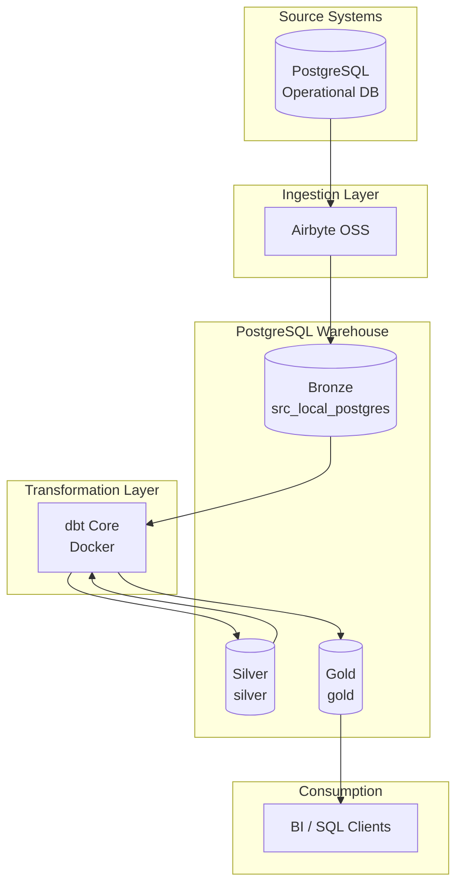

# Scalable Modern Data Stack (MDS) — Medallion Architecture

**Repository:** `end-to-end-elt-pipeline`

A modular **ELT** reference implementation that demonstrates how to ingest, transform, and serve analytics-ready data using industry-standard open-source tooling. Each platform component runs in an isolated Docker container on a shared bridge network, with clear separation between **Bronze**, **Silver**, and **Gold** layers.

---

## Overview

This project is a **production-oriented proof of concept** for a scalable data platform. It implements:

- **Extract & Load (EL)** via Airbyte into a PostgreSQL warehouse landing zone
- **Transform (T)** via dbt Core using SQL-based, testable models
- **Medallion Architecture** with conformed Silver tables and dimensional Gold marts
- **Containerized deployment** for reproducible local and portfolio demonstrations

The stack is designed to scale from a laptop PoC to a team environment by swapping orchestration and catalog tooling without redesigning the data layers.

---

## Architecture



### Medallion layers

| Layer | Schema | Owner | Purpose |
|-------|--------|-------|---------|
| **Bronze** | `src_local_postgres` | Airbyte | Raw landing tables from source systems (includes Airbyte metadata columns) |
| **Silver** | `silver` | dbt | Conformed, deduplicated **incremental tables** — decoupled from Bronze at the database catalog level |
| **Gold** | `gold` | dbt | Dimensional models (`dim_*`, `fct_*`) and report marts (`mart_*`) for analytics |

### Containerization

All services attach to an external Docker network (`de_poc_network`). Components are split into modular folders so each can be started, stopped, and versioned independently.

```
end-to-end-elt-pipeline/
├── source-postgres/       # Synthetic operational database (source)
├── warehouse-postgres/    # Analytics warehouse (destination)
├── airbyte-platform/      # Airbyte OSS ingestion stack
└── dbt-warehouse/         # dbt Core transformation project (Dockerized)
```

---

## Technology Stack

| Capability | Tool | Role |
|------------|------|------|
| **Ingestion** | [Airbyte](https://airbyte.com/) | EL pipelines from Postgres source to warehouse Bronze layer |
| **Transformation** | [dbt Core](https://www.getdbt.com/) | SQL models, tests, documentation, incremental processing |
| **Warehouse** | [PostgreSQL 16](https://www.postgresql.org/) | Central store for Bronze, Silver, and Gold |
| **Containerization** | Docker & Docker Compose | Environment isolation and reproducible deployments |
| **Orchestration** *(Roadmap)* | [Apache Airflow](https://airflow.apache.org/) | Scheduled sync → transform → test DAGs |
| **Data Catalog** *(Roadmap)* | [CKAN](https://ckan.org/) | Dataset metadata and discoverability for Gold marts |

---

## Key Highlights

- **Modular dbt models** — Staging, intermediate, dimensions, facts, and marts with `ref()`-driven lineage
- **Production Silver pattern** — Incremental **tables** (not views on Bronze), so Airbyte syncs without `DROP CASCADE`
- **Environment isolation** — Credentials via `.env` (git-ignored); `.env.example` templates for each service
- **Data quality** — dbt tests (`unique`, `not_null`, `relationships`, `dbt_utils` range checks) on sources and marts
- **Performance-aware design** — Incremental facts, indexes via post-hooks, configurable `DBT_THREADS` for ~1M+ row workloads
- **Clear operational runbook** — Documented manual workflow prior to orchestration automation

---

## Prerequisites

- Docker Engine 24+ and Docker Compose v2
- 8 GB RAM and 4 CPUs recommended (Airbyte)
- Git

---

## Quick Start

### 1. Clone and configure

```bash
git clone https://github.com/<your-username>/end-to-end-elt-pipeline.git
cd end-to-end-elt-pipeline

# Copy environment templates (never commit .env files)
cp source-postgres/.env.example source-postgres/.env
cp warehouse-postgres/.env.example warehouse-postgres/.env
cp airbyte-platform/.env.example airbyte-platform/.env
cp dbt-warehouse/.env.example dbt-warehouse/.env
```

### 2. Create the shared Docker network

```bash
docker network create de_poc_network
```

### 3. Start infrastructure (recommended order)

```bash
# Source database
cd source-postgres && docker compose up -d

# Warehouse database
cd ../warehouse-postgres && docker compose up -d

# Airbyte (first boot may take several minutes)
cd ../airbyte-platform && docker compose up -d
```

| Service | Host URL / Port |
|---------|-----------------|
| Source Postgres | `localhost:5433` |
| Warehouse Postgres | `localhost:5434` |
| Airbyte UI | [http://localhost:8000](http://localhost:8000) |

### 4. Configure Airbyte (UI)

1. **Source** — Postgres: `de_poc_source_postgres:5432` (from inside Docker network)
2. **Destination** — Postgres warehouse: `de_poc_warehouse_postgres:5432`, schema `src_local_postgres`
3. **Destination setting:** `Drop tables with CASCADE` = **OFF**
4. Create connection, select streams (`customers`, `orders`), run **Sync**

> From your Mac (DBeaver), use `localhost:5433` / `5434`. From Airbyte connectors, use container hostnames on `de_poc_network`.

### 5. Run dbt transformations

```bash
cd dbt-warehouse

# Build the dbt Docker image and install packages (first time)
make build
make deps

# First run or after full Airbyte reload
make run-full

# Incremental runs after routine syncs
make run

# Optional quality gate
make test
```

**Equivalent Docker Compose commands:**

```bash
docker compose --profile tools run --rm dbt deps --profiles-dir /usr/app
docker compose --profile tools run --rm dbt run --profiles-dir /usr/app
docker compose --profile tools run --rm dbt test --profiles-dir /usr/app
```

### 6. Query Gold layer (DBeaver / psql)

```sql
-- Star schema
SELECT
    c.customer_name,
    d.month_name,
    f.order_amount
FROM gold.fct_orders f
JOIN gold.dim_customer c USING (customer_id)
JOIN gold.dim_date d ON f.order_date_key = d.date_key
LIMIT 100;

-- Pre-aggregated mart
SELECT *
FROM gold.mart_sales_performance
ORDER BY total_revenue DESC
LIMIT 20;
```

---

## End-to-end workflow

```text
┌─────────────┐    ┌─────────────┐    ┌─────────────┐    ┌─────────────┐
│   Source    │───▶│   Airbyte   │───▶│   Bronze    │───▶│    dbt      │
│  Postgres   │    │   (EL)      │    │  (raw)      │    │  (Silver +  │
└─────────────┘    └─────────────┘    └─────────────┘    │   Gold)     │
                                                          └──────┬──────┘
                                                                 ▼
                                                          ┌─────────────┐
                                                          │  Analytics  │
                                                          │  Consumers  │
                                                          └─────────────┘
```

**Current (manual):** Airbyte Sync → `make run` → `make test`  
**Roadmap (automated):** Airflow DAG orchestrating sync, dbt run, and dbt test

Detailed runbook: [`dbt-warehouse/docs/PRODUCTION_WORKFLOW.md`](dbt-warehouse/docs/PRODUCTION_WORKFLOW.md)

---

## Daily operations

**Stop containers (data preserved):**

```bash
cd airbyte-platform && docker compose stop
cd ../warehouse-postgres && docker compose stop
cd ../source-postgres && docker compose stop
```

**Resume next day:**

```bash
cd source-postgres && docker compose start
cd ../warehouse-postgres && docker compose start
cd ../airbyte-platform && docker compose start
cd ../dbt-warehouse && make run
```

Use `docker compose down` only when intentionally removing containers (volumes are retained unless `-v` is specified).

---

## Roadmap

| Phase | Capability | Status |
|-------|------------|--------|
| 1 | Medallion ELT on Docker | ✅ Implemented |
| 2 | dbt data quality tests | ✅ Implemented |
| 3 | Apache Airflow orchestration | 🔜 Planned |
| 4 | CKAN data catalog for Gold datasets | 🔜 Planned |
| 5 | CI/CD for dbt (GitHub Actions) | 🔜 Planned |

---

## Disclaimer

> **This repository is a proof-of-concept (PoC) using synthetic datasets to demonstrate end-to-end data engineering patterns. No proprietary information or real-world business logic is included.**

All credentials in `.env.example` files are placeholders for local development only. Do not use default passwords in production environments.

---

## License

This project is intended for portfolio and educational use. Add your preferred open-source license before publishing.
