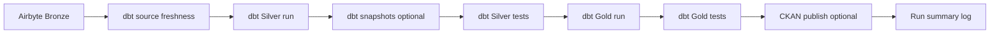

# Multi-pipeline ELT architecture (production pattern)

This PoC scales to many similar pipelines (different sources, different business logic)
without copying Airflow DAG code. **One YAML file = one DAG.**

## Layout

```
airflow-platform/
  config/
    pipelines/
      sales_local_postgres.yaml    # enabled → DAG elt_main_pipeline
      _template.yaml.example
    ckan/
      sales_local_postgres.yaml    # datasets published for that pipeline
  dags/
    elt_pipelines.py               # loads all enabled YAML → builds DAGs
    common/
      pipeline_config.py
      elt_dag_builder.py
      airbyte_sync.py
      airbyte_validate.py
      dbt_commands.py
      ckan_publish.py

dbt-warehouse/
  models/
    staging/                       # PoC: flat layout + pipeline tag
    intermediate/
    marts/
  # New source (recommended): models/pipelines/<pipeline_id>/...
```

Docker mounts `./config` → `/opt/airflow/pipeline_config` (see `docker-compose.yml`).

## Pipeline stages (same for every source)



Shared orchestration lives in `elt_dag_builder.py`. Per-pipeline differences are **config only**:
Airbyte streams, dbt selectors, CKAN tables.

## Add a new source (checklist)

### 1. Airbyte

1. Create source + connection → warehouse Bronze schema (e.g. `src_hr_system`).
2. Set streams to **incremental** + **append_dedup** with cursor fields.
3. Store connection UUID in Airflow Variable, e.g. `airbyte_connection_id_hr_system`
   → `AIRFLOW_VAR_AIRBYTE_CONNECTION_ID_HR_SYSTEM` in `airflow-platform/.env`.

### 2. dbt

1. Add source in `models/staging/_sources.yml` for the Bronze schema.
2. Add models under `models/pipelines/<pipeline_id>/` (recommended) or tag existing folders:
   ```yaml
   # dbt_project.yml or model config
   tags: ["pipeline_hr_system"]
   ```
3. Use selectors in pipeline YAML:
   - `silver_run_select: "tag:pipeline_hr_system,staging+"`
   - `gold_run_select: "tag:pipeline_hr_system,marts+"`

Run locally: `dbt run --select tag:pipeline_hr_system` before enabling the DAG.

### 3. Airflow pipeline config

```bash
cp airflow-platform/config/pipelines/_template.yaml.example \
   airflow-platform/config/pipelines/hr_system.yaml
```

Edit:

| Field | Purpose |
|--------|---------|
| `pipeline_id` | Must match filename (`hr_system.yaml` → `hr_system`) |
| `dag_id` | Unique Airflow DAG id |
| `enabled` | `true` to register DAG |
| `airbyte.expected_streams` | Preflight: incremental + cursors per table |
| `airbyte.connection_id_variable` | Airflow Variable name for connection UUID |
| `dbt.*_select` | dbt `--select` for each task |
| `ckan.publications_file` | `config/ckan/<name>.yaml` |

Restart scheduler after new YAML:  
`docker compose -f airflow-platform/docker-compose.yml restart airflow-scheduler`

### 4. CKAN (optional)

```bash
cp airflow-platform/config/ckan/sales_local_postgres.yaml \
   airflow-platform/config/ckan/hr_system.yaml
```

List Gold tables to expose. Set `ckan.enabled: true` in pipeline YAML.

### 5. Verify

- Airflow UI → DAG appears, no import errors.
- Trigger manual run; check `extraction.trigger_airbyte_sync` preflight log.
- Silver/Gold tests pass; CKAN datasets update if enabled.

## Why this is “production-shaped”

| Concern | Approach |
|---------|----------|
| 100 similar DAGs | One factory + YAML, not 100 Python files |
| Different business logic | dbt models per pipeline; Airflow stays thin |
| Safe Bronze loads | `expected_streams` preflight per pipeline |
| Catalog per domain | CKAN publications YAML per pipeline |
| CI / review | Change config + dbt in PR; DAG code rarely changes |
| Timezone / schedule | Per-pipeline `schedule` + `timezone` in YAML |

## PoC reference pipelines

| Pipeline | DAG | Schedule (Bangkok) | Source tables | dbt tag |
|----------|-----|-------------------|---------------|---------|
| Retail sales | `elt_main_pipeline` | 11:00 | `public.customers/orders` | `pipeline_sales_local_postgres` |
| SAP chemicals | `elt_sap_chemicals` | 11:30 | `sap.sap_*` (same DB) | `pipeline_sap_chemicals` |

Both pipelines read **`de_poc_source_postgres`** (`sales_source`) — one server, two Airbyte connections → two Bronze schemas. See [SAP_CHEMICALS_PIPELINE.md](./SAP_CHEMICALS_PIPELINE.md).

## Environment variables

| Variable | Used by |
|----------|---------|
| `AIRFLOW_VAR_AIRBYTE_CONNECTION_ID` | Sales PoC connection |
| `AIRFLOW_VAR_AIRBYTE_CONNECTION_ID_<SOURCE>` | Additional pipelines |
| `CKAN_API_TOKEN`, warehouse DB vars | CKAN publish task |

See also: [PRODUCTION_CHECKLIST.md](./PRODUCTION_CHECKLIST.md), [dbt PRODUCTION_WORKFLOW](../dbt-warehouse/docs/PRODUCTION_WORKFLOW.md).
