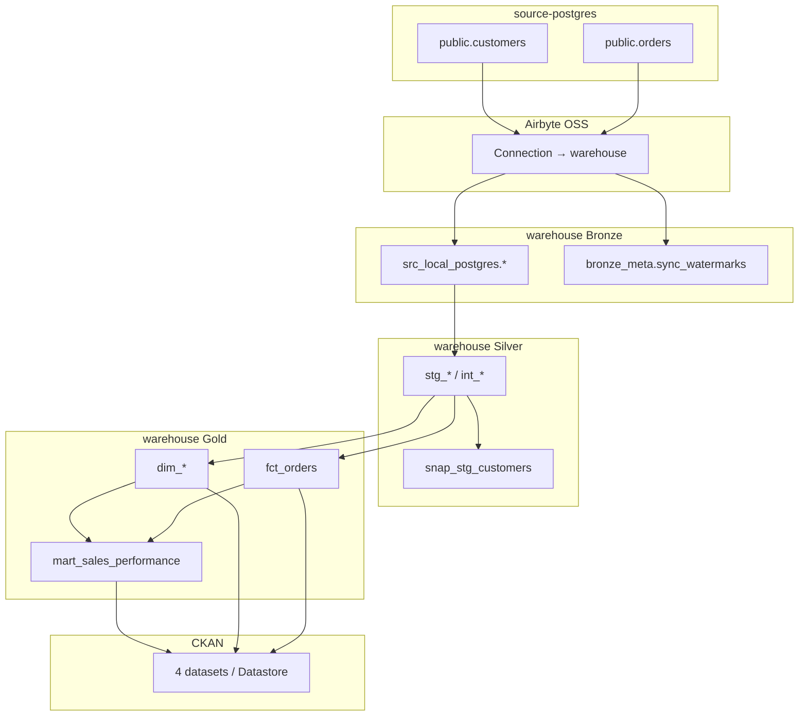
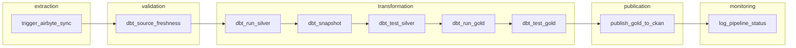

# คู่มือเรียนรู้แพลตฟอร์ม ELT (PoC) + Pipeline `sales_local_postgres`

เอกสารนี้รวบรวมคำอธิบายแบบ **folder-by-folder** ของโปรเจกต์ การเชื่อม YAML → Airflow DAG → ไฟล์ที่เกี่ยวข้อง และ **workflow end-to-end** ของ pipeline retail (`sales_local_postgres`) สำหรับใช้เรียนรู้ก่อนรันจริงหรือ debug

**เอกสารที่เกี่ยวข้อง (รายละเอียดปฏิบัติการ):**

- [RUN_STEP_BY_STEP.md](./RUN_STEP_BY_STEP.md) — ขั้นตอนเปิด stack
- [MULTI_PIPELINE_ARCHITECTURE.md](./MULTI_PIPELINE_ARCHITECTURE.md) — แพทเทิร์น one YAML = one DAG
- [CREDENTIALS.md](./CREDENTIALS.md) — ตัวแปร `.env`
- [dbt-warehouse/models/pipelines/sales_local_postgres/README.md](../dbt-warehouse/models/pipelines/sales_local_postgres/README.md) — lineage สั้นๆ ของ retail

---

## 1. ภาพรวมสถาปัตยกรรม

```text
source-postgres (OLTP mock)
       │
       ▼  Airbyte connection (ตั้งใน UI)
warehouse-postgres
  ├── Bronze:  src_local_postgres.*
  ├── Silver:  silver_sales.*
  ├── Gold:    gold_sales.*
  └── Meta:    bronze_meta.sync_watermarks
       │
       ▼  dbt (SQL models + tests)
       │
       ▼  Airflow orchestration (elt_main_pipeline)
       │
       ▼  CKAN (open data catalog)
```



**หลักการสำคัญ**

| ชั้น | ใครเป็นเจ้าของ | ตัวอย่าง retail |
|------|----------------|-----------------|
| Bronze | Airbyte | `src_local_postgres.customers`, `orders` |
| Silver | dbt (ตาราง incremental + view) | `silver_sales.stg_*`, `int_*` |
| Gold | dbt (dim / fact / mart) | `gold_sales.dim_customer`, `fct_orders`, `mart_sales_performance` |
| Catalog | Airflow task → CKAN API | package เช่น `sales-performance-mart` |

Airflow **ไม่** เขียน SQL transform เอง — เรียก Airbyte API, `dbt` CLI, และ CKAN API ตาม config

ทุก service ต่อกันผ่าน Docker network **`de_poc_network`**

---

## 2. อธิบายทีละโฟลเดอร์ (folder-by-folder)

### 2.1 `source-postgres/` — ฐานข้อมูลต้นทาง (Operational / mock)

**บทบาท:** จำลองระบบ OLTP ที่ Airbyte อ่าน (ใน production จะเป็น DB จริงของธุรกิจ)

| ไฟล์ | ทำอะไร |
|------|--------|
| `docker-compose.yml` | Postgres 16, DB `sales_source`, host port **5433** |
| `init-source.sql` | สร้าง `public.customers`, `public.orders` + seed ~20 ลูกค้า × ~50 orders |
| `init-sap-chemicals.sql` | schema `sap.*` สำหรับ pipeline SAP (DB เดียวกัน คนละ schema) |
| `.env.example` | template credentials (`POSTGRES_USER`, …) |
| `scripts/seed-orders-1m.sql` | โหลด orders จำนวนมาก (ทดสอบ performance) |
| `scripts/inject_*.sql`, `inject-bad-data.sh` | ใส่ข้อมูลเสียสำหรับ drill (orphan order, duplicate email) |
| `scripts/revert_*.sql` | ล้างข้อมูล drill |

**ตาราง retail หลัก**

- `public.customers`: `id`, `name`, `email`, `created_at`
- `public.orders`: `id`, `customer_id`, `amount`, `order_date`, `status`

Airbyte connection (ตั้งใน UI ไม่ได้อยู่ใน repo) ต้องชี้มาที่ container `de_poc_source_postgres` บน network ภายใน

---

### 2.2 `warehouse-postgres/` — Analytics warehouse

**บทบาท:** Postgres ปลายทางของ Airbyte และที่ dbt materialize Silver/Gold

| ไฟล์ | ทำอะไร |
|------|--------|
| `docker-compose.yml` | Postgres 16, DB `data_warehouse`, host port **5434** |
| `.env.example` | credentials warehouse |

**Schema ที่เกิดจาก pipeline (ไม่ได้สร้างใน init ของ warehouse — เกิดจาก Airbyte + dbt)**

- `src_local_postgres` — Bronze retail
- `silver_sales`, `gold_sales` — dbt
- `bronze_meta` — watermark หลัง sync สำเร็จ
- (pipeline อื่น: `src_sap_chemicals`, `silver_sap`, `gold_sap`, `src_api_countries`, …)

---

### 2.3 `airbyte-platform/` — Ingestion (Extract & Load)

**บทบาท:** ดึงข้อมูลจาก source → เขียนลง Bronze ใน warehouse; UI ที่ `http://localhost:8000`

| ไฟล์/โฟลเดอร์ | ทำอะไร |
|----------------|--------|
| `docker-compose.yaml` | Airbyte OSS **0.63.x** (worker, server, webapp, temporal, …) |
| `.env.example` | config Airbyte + `DOCKER_NETWORK=de_poc_network` |
| `flags.yml` | feature flags ของ platform |

**สิ่งที่ตั้งใน Airbyte UI (state อยู่ volume ไม่ใช่ git)**

1. Source → Postgres ชี้ `source-postgres`
2. Destination → Postgres ชี้ `warehouse-postgres`
3. Connection → stream `customers`, `orders` แบบ **incremental + append_dedup**
4. คัดลอก **Connection UUID** ไปใส่ `AIRFLOW_VAR_AIRBYTE_CONNECTION_ID` ใน `airflow-platform/.env`

PoC ใช้ Airbyte เป็น EL — **ไม่มี** Python ingest แยกใน repo สำหรับ JSON/API; API pipeline ก็ผ่าน Airbyte HTTP source

---

### 2.4 `dbt-warehouse/` — Transformation (T)

**บทบาท:** โปรเจกต์ dbt — SQL models, tests, snapshots, macros

| ไฟล์/โฟลเดอร์ | ทำอะไร |
|----------------|--------|
| `dbt_project.yml` | กำหนด schema/tag ต่อ pipeline (`pipeline_sales_local_postgres`, …) |
| `profiles.yml` | host warehouse, target `dev` / `prod` |
| `models/pipelines/<pipeline_id>/` | staging → intermediate → marts |
| `models/bronze_meta/_sources.yml` | freshness จาก `sync_watermarks` |
| `snapshots/pipelines/<pipeline_id>/` | SCD2 (เช่น `snap_stg_customers`) |
| `tests/pipelines/<pipeline_id>/` | singular tests |
| `macros/` | `silver_incremental_config`, dedupe Airbyte, prune |
| `selectors.yml` | `retail_pipeline`, `retail_silver` (local); Airflow YAML อาจใช้ tag กว้างกว่า |
| `Makefile` | `make run-sales`, `make test-sales`, … |
| `Dockerfile` + `docker-compose.yml` | รัน dbt ใน container บน `de_poc_network` |

**dbt คืออะไรใน PoC นี้**

- ไม่ใช่ “แอป UI” แยก — เป็น **CLI + โปรเจกต์ SQL** (`dbt run`, `dbt test`)
- เขียนโค้ดใน `models/**/*.sql` และ `*.yml`
- Airflow เรียก `dbt` จาก venv ใน image (`/home/airflow/.dbt-venv/bin/dbt`) ที่ mount `/opt/dbt`

---

### 2.5 `airflow-platform/` — Orchestration

**บทบาท:** สร้าง DAG, รันตาม schedule, เรียก Airbyte / dbt / CKAN

| ไฟล์/โฟลเดอร์ | ทำอะไร |
|----------------|--------|
| `docker-compose.yml` | webserver, scheduler, metadata postgres; mount `dbt-warehouse` → `/opt/dbt`, `config` → `/opt/airflow/pipeline_config` |
| `Dockerfile` | Airflow image + dbt venv |
| `.env.example` | `AIRFLOW_VAR_*`, `DBT_WAREHOUSE_*`, `CKAN_*` |
| `config/pipelines/*.yaml` | **หนึ่งไฟล์ enabled = หนึ่ง DAG** |
| `config/ckan/*.yaml` | รายการตาราง Gold ที่ publish |
| `dags/elt_pipelines.py` | โหลด YAML → `build_elt_dag()` → `globals()[dag_id]` |
| `dags/elt_main_pipeline.py` | comment pointer เท่านั้น — DAG จริงมาจาก YAML |
| `dags/common/elt_dag_builder.py` | factory TaskGroups |
| `dags/common/pipeline_config.py` | อ่าน YAML |
| `dags/common/airbyte_sync.py` | trigger + poll Airbyte |
| `dags/common/airbyte_validate.py` | preflight streams |
| `dags/common/bronze_watermark.py` | upsert `bronze_meta.sync_watermarks` |
| `dags/common/dbt_commands.py` | สร้าง bash `dbt …` |
| `dags/common/ckan_publish.py` | copy Gold → CKAN Datastore |
| `dags/common/alerting.py` | email เมื่อ task fail |
| `docs/AIRFLOW_SETUP.md`, `AIRFLOW_ALERTING.md` | setup / alerting |

UI: `http://localhost:8080` — DAG retail ชื่อ **`elt_main_pipeline`**

---

### 2.6 `ckan-platform/` — Open data catalog

**บทบาท:** แสดง Gold tables ให้ผู้ใช้ธุรกิจ (Data Explorer, download CSV)

| ไฟล์/โฟลเดอร์ | ทำอะไร |
|----------------|--------|
| `docker-compose.yml` | CKAN + Solr + Redis + Postgres ของ CKAN |
| `scripts/bootstrap-ckan.sh` | สร้าง org, API token → sync ไป `airflow-platform/.env` |
| `ckanext-ube_theme/` | theme UBE (CSS, templates, homepage) |
| `docs/CKAN_SETUP.md` | bootstrap, token, troubleshooting |

ข้อมูลใน CKAN มาจาก task `publish_gold_to_ckan` — **อ่านจาก warehouse** แล้ว upsert ผ่าน CKAN API (ไม่ใช่ Airbyte โดยตรง)

---

### 2.7 `docs/` — Runbook และ design docs

| ไฟล์ | เนื้อหา |
|------|---------|
| `README.md` | index เอกสาร |
| `RUN_STEP_BY_STEP.md` | เปิด stack ทีละขั้น (ภาษาไทย) |
| `MULTI_PIPELINE_ARCHITECTURE.md` | เพิ่ม pipeline ใหม่ |
| `PRODUCTION_CHECKLIST.md` | checklist ก่อนรันประจำ |
| `MONITORING_FAILURE_DRILL.md` | ฝึก incident |
| `API_COUNTRIES_PIPELINE.md`, `SAP_CHEMICALS_PIPELINE.md` | pipeline อื่น |

---

## 3. Pipeline YAML → เรียกไฟล์อะไรบ้าง (`sales_local_postgres`)

ไฟล์หลัก: `airflow-platform/config/pipelines/sales_local_postgres.yaml`

### 3.1 ลำดับการโหลด

```text
sales_local_postgres.yaml
        │
        ▼ (ตอน Airflow parse DAG)
elt_pipelines.py  →  load_all_pipeline_configs()
        │
        ▼
elt_dag_builder.build_elt_dag(cfg)
        │
        ▼
DAG id: elt_main_pipeline
```

- `pipeline_config.config_root()` → `/opt/airflow/pipeline_config` (mount จาก `./config`)
- `enabled: false` → ไม่สร้าง DAG

### 3.2 แมปแต่ละบล็อกใน YAML

| ส่วนใน YAML | Task / โมดูล | ผลลัพธ์ |
|-------------|--------------|---------|
| `airbyte.*` | `airbyte_sync.py` + `airbyte_validate.py` | sync → `src_local_postgres.*` + watermark |
| `dbt.freshness_select` | `dbt_commands.py` → `dbt source freshness` | เช็ค SLA sync |
| `dbt.silver_run_select` | `dbt run` | Silver (+ อาจรวม Gold ถ้า tag เดียวกัน — ดูหมายเหตุด้านล่าง) |
| `dbt.snapshots` | `dbt snapshot` | `gold_sales.snap_stg_customers` |
| `dbt.silver_test_select` | `dbt test` + singular | gate ก่อน Gold rerun / CKAN |
| `dbt.gold_run_select` / `gold_test_select` | `dbt run` / `test` | Gold |
| `ckan.publications_file` | `ckan_publish.py` + `config/ckan/sales_local_postgres.yaml` | 4 CKAN packages |

### 3.3 Task groups ใน DAG



- **Silver test fail** → `dbt_run_gold` และ CKAN ไม่รัน
- **monitoring** รันเสมอ (`trigger_rule=all_done`)

### 3.4 ตัวแปร environment ที่เกี่ยว (retail)

```bash
# airflow-platform/.env
AIRFLOW_VAR_AIRBYTE_CONNECTION_ID=<uuid จาก Airbyte UI>
AIRFLOW_VAR_AIRBYTE_API_BASE_URL=http://airbyte-proxy:8000/api/v1

DBT_WAREHOUSE_HOST=de_poc_warehouse_postgres
DBT_WAREHOUSE_PORT=5432
DBT_WAREHOUSE_USER=...
DBT_WAREHOUSE_PASSWORD=...
DBT_WAREHOUSE_DB=data_warehouse

CKAN_URL=http://ckan:5000
CKAN_API_TOKEN=...
CKAN_ORGANIZATION=ube-group-thailand
```

`connection_id_variable: airbyte_connection_id` หมายถึงชื่อ **Airflow Variable** ไม่ใช่ชื่อไฟล์

### 3.5 หมายเหตุ selector ใน Airflow

ใน YAML ปัจจุบัน `silver_run_select` และ `gold_run_select` ใช้ `tag:pipeline_sales_local_postgres` เหมือนกัน — task `dbt_run_silver` อาจ materialize ถึง Gold ในรอบแรกแล้ว; **gate จริง** คือ `dbt_test_silver` ก่อน `dbt_run_gold` และ CKAN

ถ้าต้องการแยกชัด: ใช้ selector `retail_silver` ใน `dbt-warehouse/selectors.yml` (intersection `medallion_silver` + pipeline tag) สำหรับ task Silver — ยังไม่ได้ตั้งใน YAML ของ PoC

---

## 4. Workflow end-to-end: `sales_local_postgres` (file-by-file)

Pipeline id: `sales_local_postgres`  
DAG id: **`elt_main_pipeline`**  
Schedule: `0 11 * * *` (Asia/Bangkok)

### 4.1 ชั้นที่ 0 — Source

**ไฟล์:** `source-postgres/init-source.sql`

- สร้างและ seed `public.customers`, `public.orders`
- Airbyte อ่านตารางเหล่านี้ → เขียน warehouse schema **`src_local_postgres`**

---

### 4.2 ชั้นที่ 1 — ลงทะเบียน DAG

| ไฟล์ | บทบาท |
|------|--------|
| `config/pipelines/sales_local_postgres.yaml` | config หลัก |
| `dags/elt_pipelines.py` | loop enabled YAML → สร้าง DAG |
| `dags/common/pipeline_config.py` | `yaml.safe_load` |
| `dags/common/elt_dag_builder.py` | TaskGroups + dependencies |

---

### 4.3 ชั้นที่ 2 — Extraction (task: `extraction.trigger_airbyte_sync`)

**โมดูล:** `dags/common/airbyte_sync.py` → `make_airbyte_sync_callable(airbyte_cfg)`

ลำดับภายใน task:

1. **`airbyte_validate.py`** — `POST /connections/get`  
   เทียบ `expected_streams` ใน pipeline YAML:
   - `customers`: incremental, append_dedup, cursor `created_at`
   - `orders`: cursor `order_date`
2. **`POST /connections/sync`** — trigger (หรือ attach job 409)
3. Poll **`POST /jobs/get`** ทุก 30s สูงสุด 7200s
4. **`bronze_watermark.py`** — upsert `bronze_meta.sync_watermarks` สำหรับ `src_local_postgres`

**ผลใน warehouse**

- `src_local_postgres.customers` (+ `_airbyte_extracted_at`, …)
- `src_local_postgres.orders`
- แถว watermark สำหรับ freshness

---

### 4.4 ชั้นที่ 3 — Validation (task: `validation.dbt_source_freshness`)

| ไฟล์ | บทบาท |
|------|--------|
| `dags/common/dbt_commands.py` | `dbt source freshness --select source:bronze_meta.watermark_src_local_postgres` |
| `dbt-warehouse/models/bronze_meta/_sources.yml` | SLA: warn 36h / error 48h นับจาก `synced_at` |

ความหมาย: ถ้า **ไม่มี sync สำเร็จ** เกิน ~48 ชม. → fail (ไม่ใช่เช็คแถวใน Bronze โดยตรง)

---

### 4.5 ชั้นที่ 4 — Transformation

#### การตั้งค่ารวม

**ไฟล์:** `dbt-warehouse/dbt_project.yml` (บล็อก `pipelines.sales_local_postgres`)

| โฟลเดอร์ model | schema | materialized |
|----------------|--------|--------------|
| `staging/` | `silver_sales` | incremental |
| `intermediate/` | `silver_sales` | view |
| `marts/dimensions/`, `marts/facts/` | `gold_sales` | incremental |
| `marts/marts/` | `gold_sales` | table |

**Snapshot:** `snapshots/pipelines/sales_local_postgres/snap_stg_customers.sql` → `gold_sales.snap_stg_customers`

---

#### Task: `transformation.dbt_run_silver`

Selector: `tag:pipeline_sales_local_postgres`

| ไฟล์ | ผลลัพธ์ |
|------|---------|
| `staging/_sources.yml` | ประกาศ `source('src_local_postgres', …)` + tests บน Bronze |
| `staging/stg_customers.sql` | `silver_sales.stg_customers` — rename, dedupe, incremental |
| `staging/stg_orders.sql` | `silver_sales.stg_orders` |
| `staging/_staging.yml` | tests Silver (unique, relationships) |
| `intermediate/int_orders_enriched.sql` | view — `order_date_key`, `order_value_segment` |
| `intermediate/_intermediate.yml` | tests บน intermediate |
| `marts/dimensions/dim_customer.sql` | `gold_sales.dim_customer` |
| `marts/dimensions/dim_date.sql` | `gold_sales.dim_date` (calendar spine) |
| `marts/facts/fct_orders.sql` | `gold_sales.fct_orders` |
| `marts/marts/mart_sales_performance.sql` | `gold_sales.mart_sales_performance` |

**Macros ที่ staging ใช้**

- `macros/silver_incremental_config.sql`
- `macros/get_raw_incremental_predicate.sql`
- `macros/dedupe_airbyte_change_data.sql`

---

#### Task: `transformation.dbt_snapshot`

| ไฟล์ | ผลลัพธ์ |
|------|---------|
| `snapshots/.../snap_stg_customers.sql` | SCD2 ประวัติลูกค้าใน `gold_sales.snap_stg_customers` |

---

#### Task: `transformation.dbt_test_silver`

Selector: `tag:pipeline_sales_local_postgres source:src_local_postgres`  
+ `run_singular_tests: true` → `dbt test --select test_type:singular`

| ไฟล์ | บทบาท |
|------|--------|
| `tests/pipelines/sales_local_postgres/assert_no_orphan_orders_in_silver.sql` | fail ถ้า order ไม่มี customer ใน Silver |

---

#### Task: `transformation.dbt_run_gold` / `dbt_test_gold`

รัน/ทดสอบ models ที่มี tag `pipeline_sales_local_postgres` (Gold layer) — มักเป็น rerun หลัง gate Silver

---

### 4.6 ชั้นที่ 5 — Publication (task: `publication.publish_gold_to_ckan`)

| ไฟล์ | บทบาท |
|------|--------|
| `config/ckan/sales_local_postgres.yaml` | รายการ 4 publications |
| `dags/common/ckan_publish.py` | preflight token → `datastore_create` + `datastore_upsert` |

| CKAN package | Warehouse table |
|--------------|-----------------|
| `sales-performance-mart` | `gold_sales.mart_sales_performance` |
| `customer-dimension` | `gold_sales.dim_customer` |
| `date-dimension` | `gold_sales.dim_date` |
| `orders-fact` | `gold_sales.fct_orders` |

`max_rows` บาง dataset จำกัดแถวใน catalog (warehouse ยังมีเต็ม)

---

### 4.7 ชั้นที่ 6 — Monitoring

**Task:** `monitoring.log_pipeline_status`  
**โค้ด:** `elt_dag_builder._log_pipeline_run_status` — สรุป state ทุก task + XCom จาก Airbyte

**Callback:** `alerting.elt_task_failure_email` บน `default_args` (ถ้าตั้ง SMTP)

---

### 4.8 สรุปตาราง: ขั้นตอน → ไฟล์ → ตารางใน DB

| ขั้น | ไฟล์หลัก | ผลใน PostgreSQL |
|------|----------|-----------------|
| Source | `source-postgres/init-source.sql` | `public.customers`, `public.orders` |
| Ingest | Airbyte + `airbyte_sync.py` | `src_local_postgres.*` |
| Watermark | `bronze_watermark.py` | `bronze_meta.sync_watermarks` |
| SLA | `bronze_meta/_sources.yml` | freshness check |
| Silver | `stg_*.sql`, `int_*.sql` | `silver_sales.*` |
| SCD2 | `snap_stg_customers.sql` | `gold_sales.snap_stg_customers` |
| Gold | `dim_*.sql`, `fct_orders.sql`, `mart_*.sql` | `gold_sales.*` |
| Catalog | `config/ckan/sales_local_postgres.yaml` | CKAN Datastore |

---

### 4.9 ลำดับเวลาเมื่อ Trigger DAG หนึ่งครั้ง

```text
T0  Airflow เริ่ม DAG run
T1  Preflight Airbyte → sync → poll → watermark
T2  dbt source freshness
T3  dbt run (Silver/Gold ตาม tag)
T4  dbt snapshot (ลูกค้า SCD2)
T5  dbt test Silver (+ singular) — FAIL = หยุด Gold rerun & CKAN
T6  dbt run Gold
T7  dbt test Gold
T8  CKAN upsert 4 datasets
T9  log_pipeline_status
```

---

### 4.10 Lineage dbt (retail)

```text
src_local_postgres.customers  →  silver_sales.stg_customers  →  gold_sales.dim_customer
                                                              →  gold_sales.snap_stg_customers
src_local_postgres.orders     →  silver_sales.stg_orders
                                      ↓
                               silver_sales.int_orders_enriched
                                      ↓
                               gold_sales.fct_orders  →  gold_sales.mart_sales_performance
                               gold_sales.dim_date
```

---

## 5. Debug เร็ว — อาการ → เปิดไฟล์ไหนก่อน

| อาการ | เปิดก่อน |
|--------|----------|
| Sync ไม่ขึ้น Bronze | Airbyte UI, `airbyte_validate.py`, `AIRFLOW_VAR_AIRBYTE_CONNECTION_ID` |
| Freshness fail | `bronze_meta.sync_watermarks`, log task Airbyte |
| Silver test fail | `assert_no_orphan_orders_in_silver.sql`, `stg_*.sql` |
| Gold ผิด/ว่าง | `int_orders_enriched.sql`, `fct_orders.sql`, `mart_sales_performance.sql` |
| CKAN ไม่ขึ้น | `ckan-platform/scripts/bootstrap-ckan.sh`, `CKAN_API_TOKEN`, `config/ckan/sales_local_postgres.yaml` |

**SQL ตัวอย่างหลังแต่ละขั้น**

```sql
select count(*) from src_local_postgres.orders;
select count(*) from silver_sales.stg_orders;
select count(*) from gold_sales.mart_sales_performance;
```

---

## 6. Pipeline อื่นใน repo (อ้างอิงสั้นๆ)

| Pipeline | Bronze | DAG (ตัวอย่าง) | เอกสาร |
|----------|--------|----------------|--------|
| SAP chemicals | `src_sap_chemicals` | `elt_sap_chemicals` | [SAP_CHEMICALS_PIPELINE.md](./SAP_CHEMICALS_PIPELINE.md) |
| API countries | `src_api_countries` | (YAML แยก) | [API_COUNTRIES_PIPELINE.md](./API_COUNTRIES_PIPELINE.md) |

แพทเทิร์นเดียวกับ retail: YAML → `elt_dag_builder` → dbt ใต้ `models/pipelines/<id>/` → CKAN ใต้ `config/ckan/<id>.yaml`

---

## 7. สิ่งที่ควรจำ (สรุปสั้น)

1. **หนึ่ง pipeline YAML (enabled) = หนึ่ง Airflow DAG** — retail คือ `elt_main_pipeline`
2. **Airbyte** ทำ Bronze; **dbt** ทำ Silver/Gold; **Airflow** เรียงลำดับและ gate tests; **CKAN** รับ publish จาก Gold
3. **Logic transform อยู่ใน `dbt-warehouse/models/pipelines/sales_local_postgres/`** ไม่ใช่ใน DAG Python
4. **Config orchestration อยู่ใน `airflow-platform/config/`** + `dags/common/*.py`
5. Trigger DAG หนึ่งครั้ง = หนึ่งรอบ E2E ของ pipeline นั้น (ถ้าไม่ fail กลางทาง)

---

*อัปเดตจากบทสนทนาเรียนรู้แพลตฟอร์ม + workflow `sales_local_postgres` — สอดคล้องกับโค้ดใน repo ณ เวลาที่จัดทำเอกสาร*
